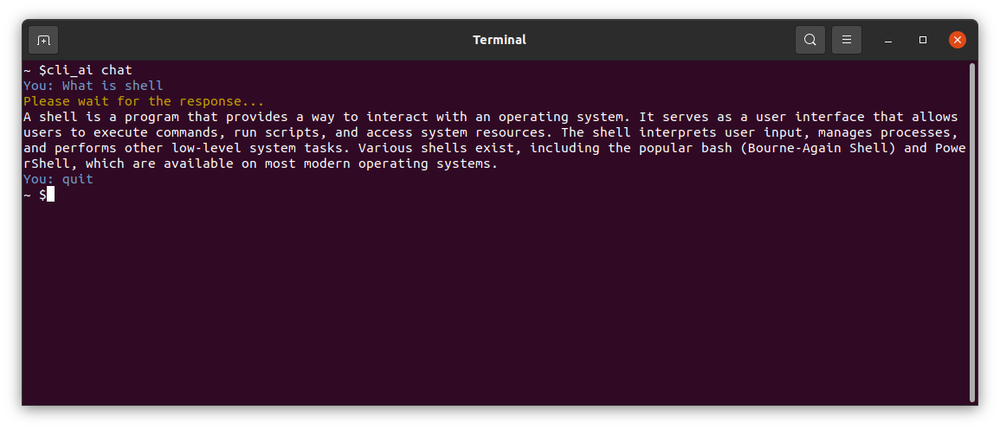
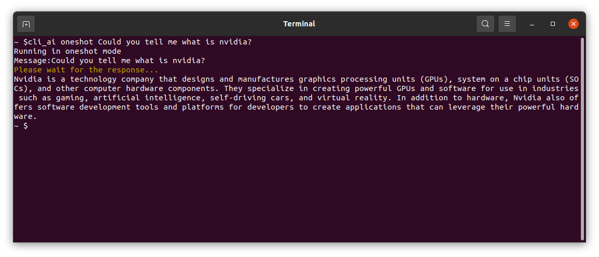
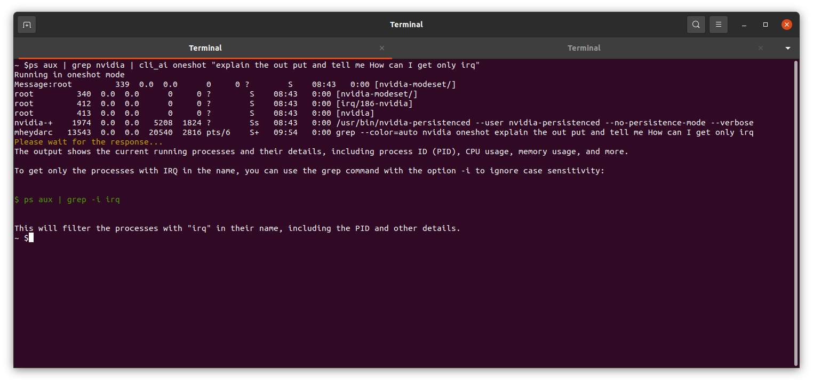
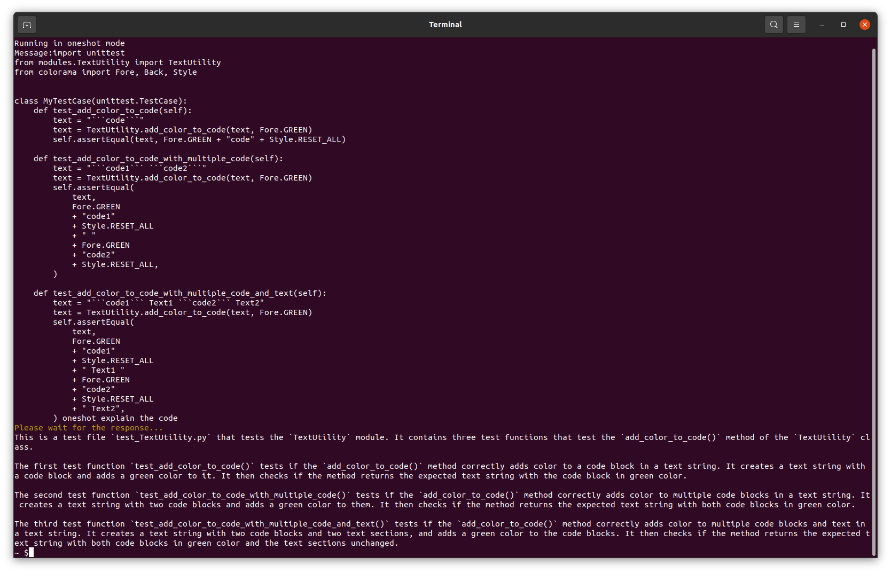
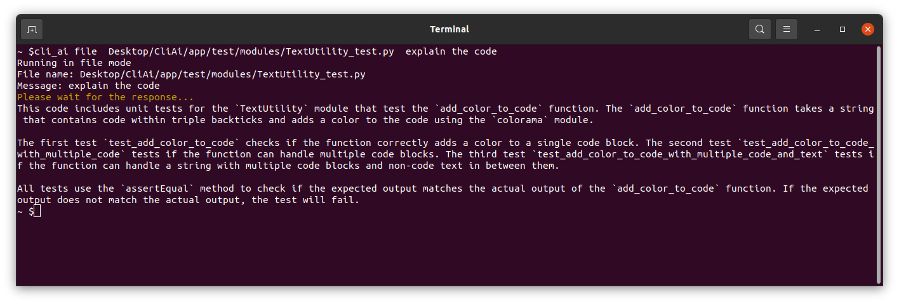

# CliAi
A shell assist powered by ChatGPT

**CliAi** is a command-line interface (CLI) application that allows you to interact with the ChatGPT language model easily. It is designed to run in three different modes: chat, oneshot, and file. Additionally, it supports code colorization in the response to enhance readability.

### This is an experimental project. So it may have some bugs. Feel free to submit a pull request if you have any ideas for new features, improvements or report any bugs!

## Features
- **Chat mode**: Engage in a real-time conversation with ChatGPT.
- **One-shot mode**: Get an instant response by providing an input.
- **File mode**: Process input from a file or the result of another shell command.
- **Code colorization**: Automatically colorizes code in the response for better readability.
- **Setup script**: A setup.sh script to install dependencies and create a cli_ai command in the shell.


## Getting Started
### Prerequisites
- Python 3.7 or higher
- An API key for ChatGPT
&ensp;

### Installation
**Clone the repositories**:
```
git clone https://github.com/Heydarchi/CliAi.git
cd CliAi
```
&ensp;

**Install dependencies**:

Run the setup script to install dependencies and create the cli_ai command:
```
./setup.sh
```
On the first run, you will be prompted to enter your ChatGPT API key.

## Usage
### Chat Mode
To start a chat session with ChatGPT, simply run the following command:
```
cli_ai chat
```
You can then interact with ChatGPT by typing your messages and pressing Enter.



**Note**: You can exit the chat session by typing **exit** or **quit**.

### One-Shot Mode
To get an instant response from ChatGPT, use the following command:
```
cli_ai oneshot "Your question or prompt here"
```






### File Mode
To process input from a file or the result of another shell command, use the following command:
```
cli_ai file input.txt "Message 1" "Message 2" "Message 3"
```
Replace input.txt with the path to your input file, and provide additional messages as arguments after the file name.




Customization
To customize the behavior of the CLI, you can use the following optional flags:

**--help** - Display help information about available commands and flags.

## License
This project is licensed under the MIT License. See the LICENSE file for details.

## Contributing
Contributions to CliAi are welcome and greatly appreciated! Here are some ways you can contribute:

- **Report bugs:** Create a GitHub issue describing the bug, its expected behavior, and the steps to reproduce it.
- **Suggest features**: Open a GitHub issue with a detailed description of the feature you'd like to see implemented.
- **Submit a pull request**: If you've implemented a feature or fixed a bug yourself, submit a pull request with your changes. Make sure to include a description of your changes and any additional information that might be helpful during the review process.

Before submitting a pull request, please ensure that your code adheres to the existing code style and that all tests pass.

### How to run spell check locally
There is a script to run spell check locally. It will check all the files in the `app` directory and ignore the words in the `app/config/codespell_ignore.txt` file.

```
codespell -I app/config/codespell_ignore.txt app/
```
&ensp;
### How to run spell check locally
Before pushing any changes, please run the following command to check the code style:

```
black --check app/
```
To fix the code style, run the following command:

```
black app/
```

### How to run the tests
To run the tests, run the following command:

```
pytest app/tests/
```

&ensp;

### Pattern to create a new branch
Please use the patterns below to create a new branch for your changes:
&ensp;

- **feature/<feature-name>**: For new features or enhancements.
- **bugfix/<bug-name>**: For bug fixes.
- **hotfix/<issue-name>**: For critical fixes that need to be merged quickly.
- **refactor/<component-name>**: For code refactoring.
- **docs/<documentation-change>**: For changes in documentation.
&ensp;
Thank you for considering contributing to CliAi!